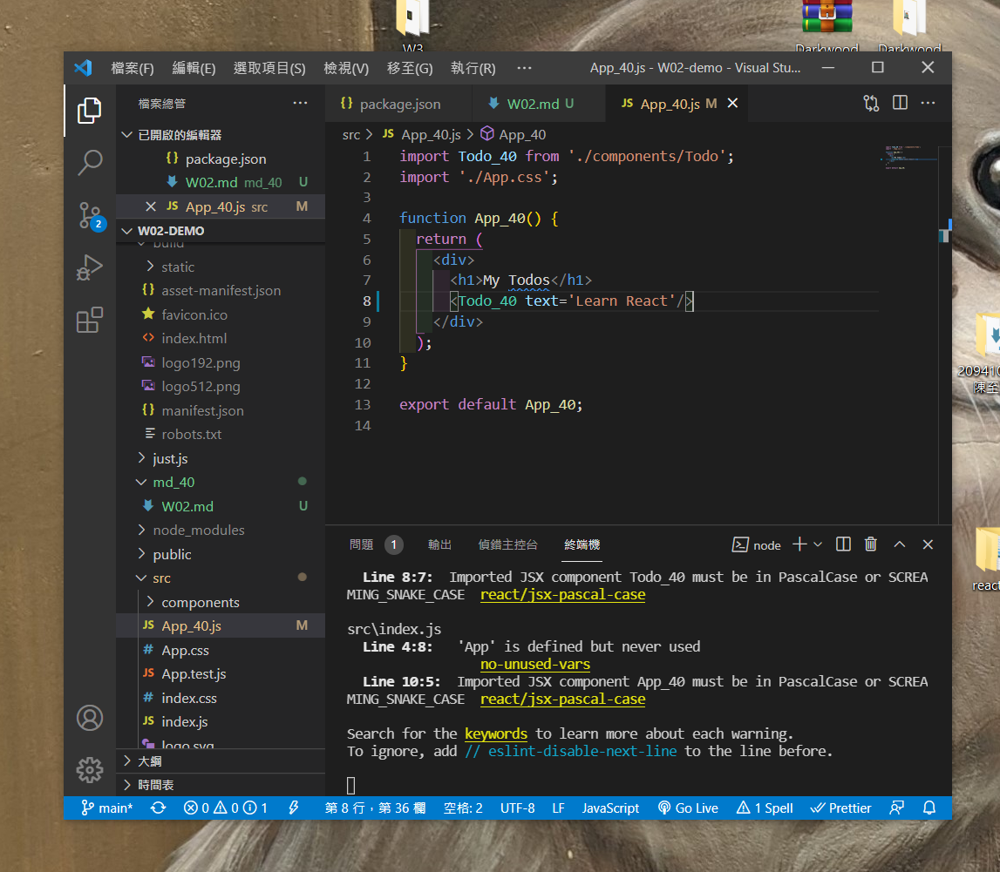
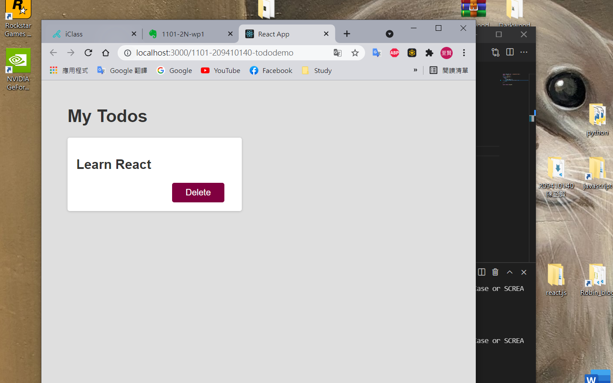
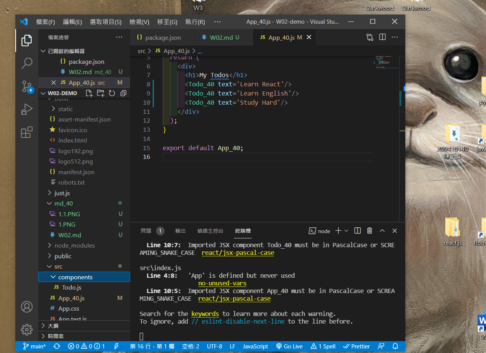
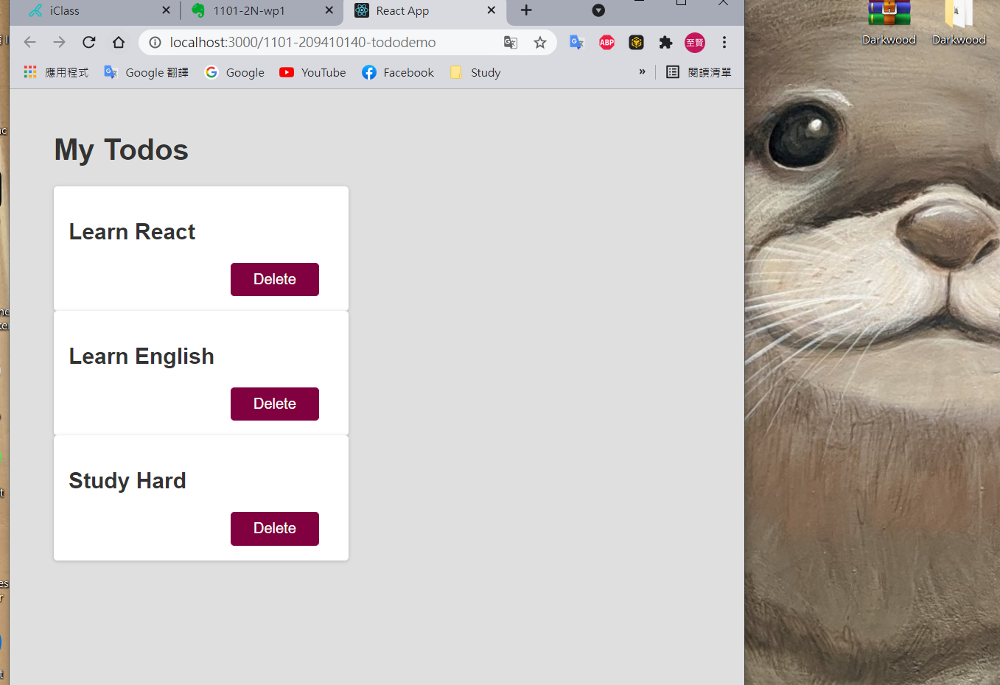
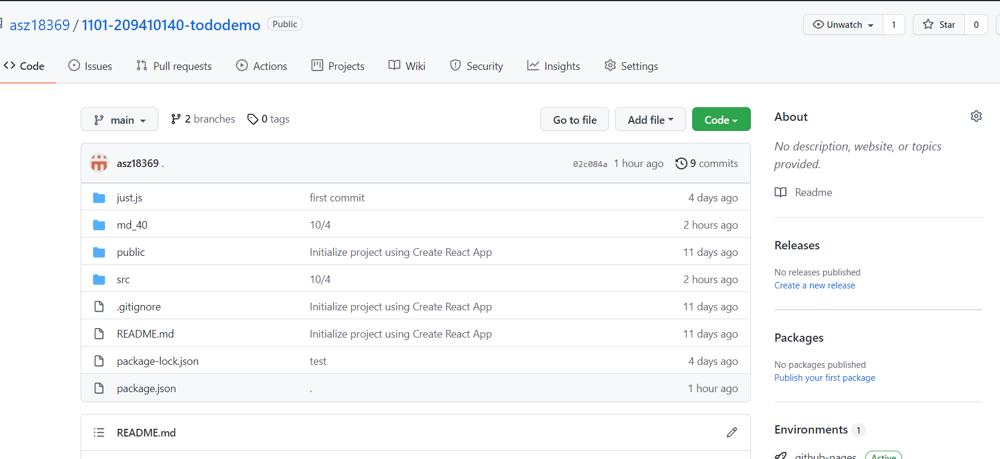
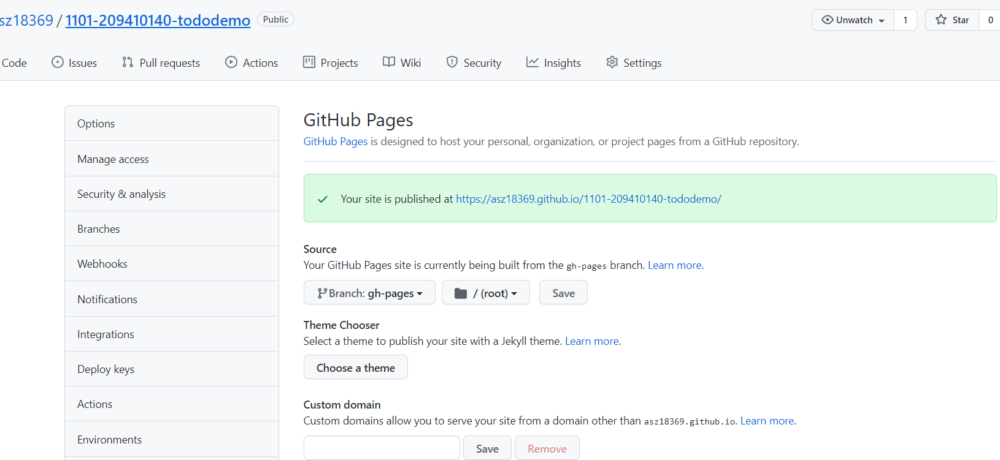
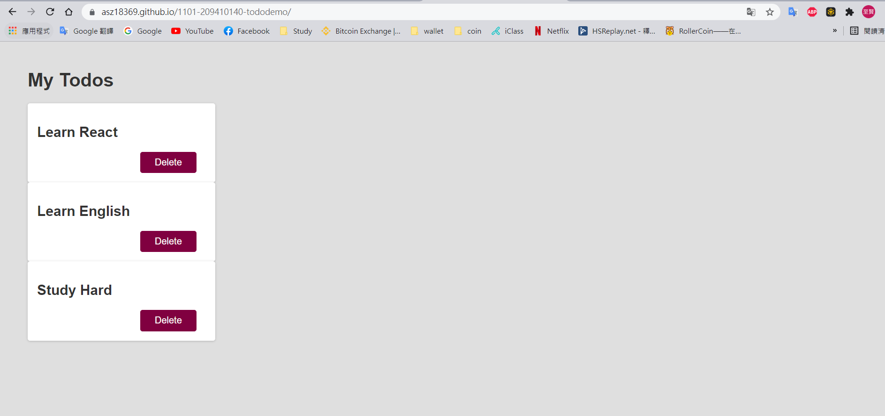
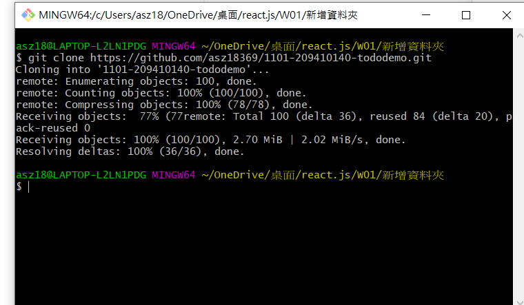
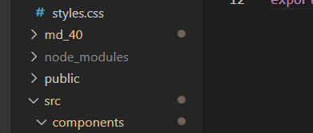
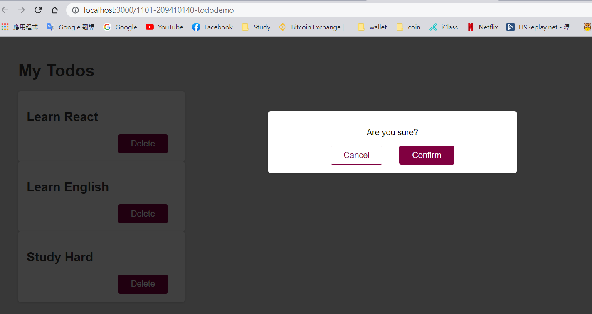

# W02 Homework 209410140 陳至賢
#### 第一題
* code


* localhost


#### 第二題
* code

* localhost

#### 第三題
###[Github](https://github.com/asz18369/1101-209410140-tododemo)

* gh-pages分支

* Github pages
###[Github pages](https://asz18369.github.io/1101-209410140-tododemo/)

#### 第四題


#### 第五題

#### Modal
```
function Modal_40(){

    return(
        <div className="modal">
            <p>Are you sure?</p>
            <button className="btn btn--alt">Cancel</button>
            <button className="btn">Confirm</button>
        </div>
    )
}

export default Modal_40;
```
#### Backdrop
```
function Backdrop_40(){
    return(
        <div className="backdrop"></div>
    )
}

export default Backdrop_40;
```

